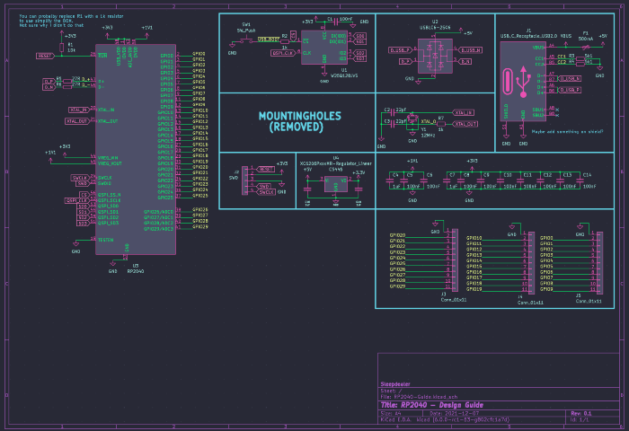

[](https://forthebadge.com)[](https://forthebadge.com)[](https://forthebadge.com)

# Hardware design for the RP2040

This guide requires you to have prerequisite knowledge about PCB design and a little about the RP2040. This is not a guide for absolute beginners and should not be treated as one.

I have multiple tested and working boards using the RP2040, including an open source one you can find [here](https://github.com/Sleepdealr/RPAD)!

## Contents

- [Hardware design for the RP2040](#hardware-design-for-the-rp2040)
  - [Contents](#contents)
  - [KiCad Version](#kicad-version)
  - [Libraries](#libraries)
  - [Extra Resources](#extra-resources)
  - [Schematic](#schematic)
    - [Component Choices](#component-choices)
      - [Voltage Regulator](#voltage-regulator)
      - [Crystal](#crystal)
      - [Flash](#flash)
      - [Pushbuttons](#pushbuttons)
  - [PCB](#pcb)
    - [Placement / Routing](#placement--routing)
    - [BOM](#bom)
  - [Firmware](#firmware)
  - [Flashing QMK on Linux from CLI](#flashing-qmk-on-linux-from-cli)
  - [Extra info](#extra-info)
    - [EEPROM](#eeprom)
  - [Too Complicated?](#too-complicated)

## KiCad Version

To open these files, you will need a recent stable version of KiCad (6.0 or later).

Stop using KiCad 5.X, it's out of date

## Libraries

You can either import them into your own library or keep them separate.

- Symbol:
  - Created by me to be easier to use
  - `/PCB/Libraries/Sleep-lib`
- Footprint:
  - Taken from Raspberry
  - `/PCB/Libraries/Footprints/RP2040-QFN-56.kicad_mod`
  - 3D Model is included

Images of the 3DView, EEschema, and PCBNew in the `/img` folder.

## Extra Resources

All the other information I found about the chip is in in the `/Pico-Resources` Folder

## Schematic

[PDF of schematic](PCB/RP2040-Guide.pdf)

THIS IMAGE WILL BE OUT OF DATE. LOOK AT THE PDF FOR THE LATEST VERSION.


If you want to know more about the components choices, read the section below or Raspberry's hardware design example.
The PDF is `/Pico-Resources/hardware-design-with-rp2040.pdf`.

I would also recommend reading my [Best practices for PCB Design](https://gist.github.com/Sleepdealr/ab05f5edb82eae9e0393f4d63da55adf) guide before making your own schematic or PCB

Breakout for SWD/GPIO is NOT required.

### Component Choices

Trust me on these pls

#### Voltage Regulator

Use the XC6206, it's a basic part on JLC. The 200mA it provides is plenty for the RP2040.

The AMS1117 has high quiescent current, needs large caps, and has a bad minimum load. Don't use it.

#### Crystal

C9002 is a great basic part for a 12MHz 3225 crystal

#### Flash

There are a ton of options for flash, but I tend to stick with C82317 as it's a basic part and has a good price. More than enough flash for any keyboard.

#### Pushbuttons

Although I didn't use a button on the included PCB files, you can easily add one yourself. A good cheap button that fits the Alps SKQG footprint is C318884.

####

## PCB

THIS IMAGE WILL BE OUT OF DATE. LOOK AT THE KiCad FILES FOR THE LATEST VERSION.


### Placement / Routing

- Fills inside of the MCU were taken from the design example. You can just copy paste them out. Make sure to set the correct zone priority and clearances. Zones are filled from high to low numbers.
- Keep the decoupling capacitors close to their respective pins.
- Keep the flash and crystal as close as possible to the MCU with minimal overlaps
- I would suggest including an actual switch for USB BOOT on production boards to make it easier, but that's up to you.

### BOM

- Everything on the PCB can be assembled by JLC. Cost for a few units is a bit high due to all the extended components
- I have tested and working JLC part numbers for all of the components, but please check if they are all in stock and at a reasonable price first before ordering. There could be a better alternative available.
- There are a few different flash sizes and packages to choose from. Use the cheapest compatible one. The basic part one may not always be the cheapest

## Firmware

- QMK
  - KarlK90's PR: <https://github.com/qmk/qmk_firmware/pull/14877>
  - KarlK90's Branch: <https://github.com/KarlK90/qmk_firmware/tree/feature/raspberry-pi-rp2040-support>
- VIAL
  - <https://github.com/vial-kb/vial-qmk/tree/rp2040>
    - This is based off of Sekigon-Gonnoc's work
- KMK
  - <https://github.com/KMKfw/kmk_firmware>
- Keyberon
  - <https://github.com/TeXitoi/keyberon>

To flash, hold the USB-BOOT button down as you plug in the keyboard (like Bootmagic reset)

## Flashing QMK on Linux from CLI

You will need to install picotool with your distro's package manager of choice, or [build it manually](https://github.com/raspberrypi/picotool#building).

In order to be able to flash properly, you will need to configure a custom udev rule.

Open a terminal and execute this script.

```bash
sudo mkdir -p /etc/udev/rules.d/
echo '# /etc/udev/rules.d/99-pico.rules

# Make an RP2040 in BOOTSEL mode writable by all users, so you can `picotool`
# without `sudo`.
SUBSYSTEM=="usb", ATTRS{idVendor}=="2e8a", ATTRS{idProduct}=="0003", MODE="0666"

# Symlink an RP2040 running MicroPython from /dev/pico.
#
# Then you can `mpr connect $(realpath /dev/pico)`.
SUBSYSTEM=="tty", ATTRS{idVendor}=="2e8a", ATTRS{idProduct}=="0005", SYMLINK+="pico"", TAG+="uaccess", TAG+="udev-acl"' | sudo tee /etc/udev/rules.d/99-pico.rules
sudo udevadm control --reload-rules
sudo udevadm trigger
```

Command borrowed from xyz's VIAL docs

## Extra info

### EEPROM

While the Raspberry Pi Pico RP2040 does not come with an EEPROM onboard, we simulate one by using a single 4K chunk of flash at the end of flash space.

**Note that this is a simulated EEPROM and will only support the number of writes as the onboard flash chip, not the 100,000 or so of a real EEPROM.** Therefore, do not frequently update the EEPROM or you may prematurely wear out the flash.

Source: <https://arduino-pico.readthedocs.io/en/latest/eeprom.html>

This isn't really an issue, as the flash chip I used is rated for 100k cycles [link to datasheet](https://www.winbond.com/resource-files/w25q128jv_dtr%20revc%2003272018%20plus.pdf)

## Too Complicated?

If all of this seems too daunting, my commissions are open! You can contact me on discord at Sleepdealer#0001 or through email at sleepdealer01@protonmail.com

Portfolio: <https://imgur.com/a/Rk1bR8Z>
